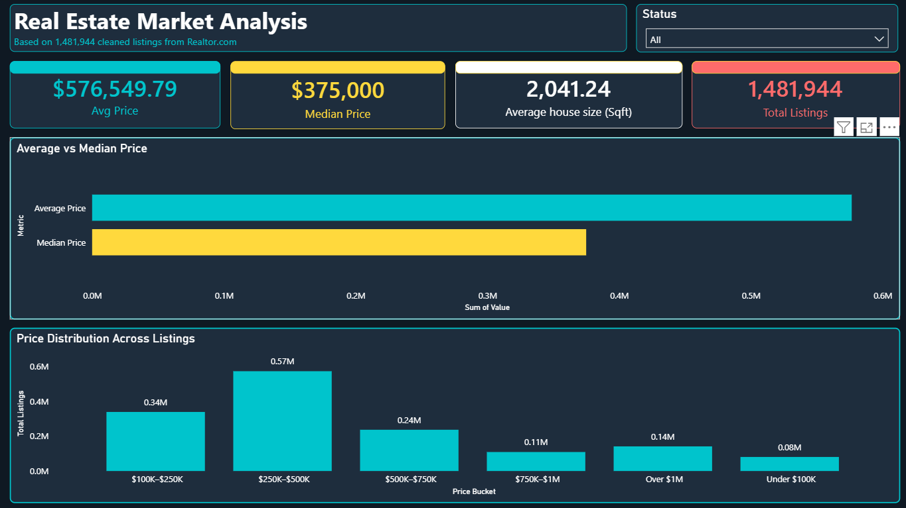
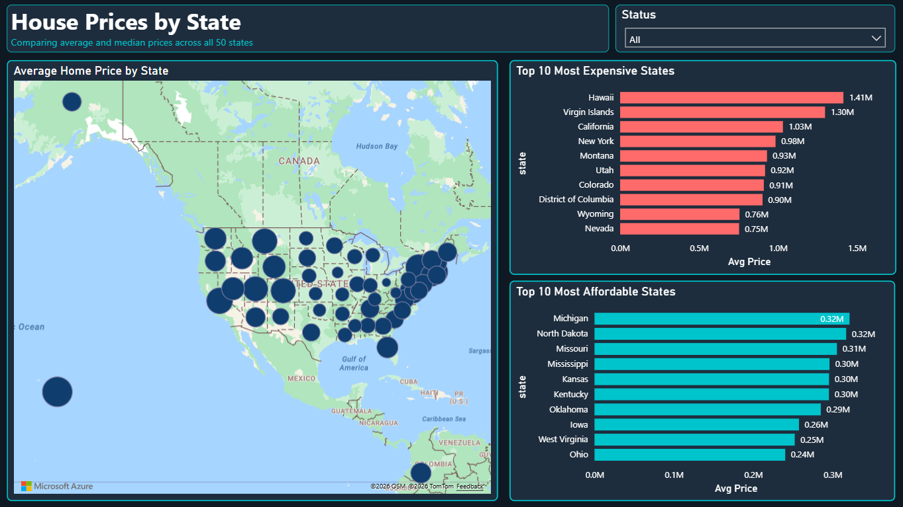
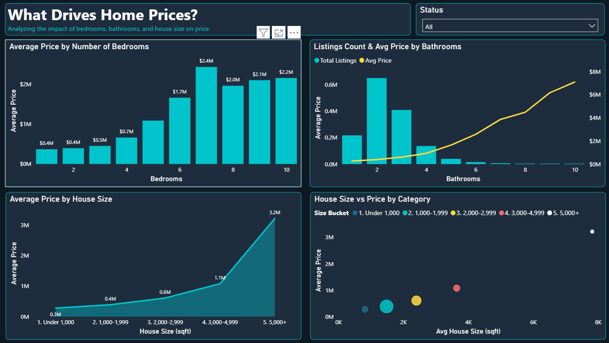
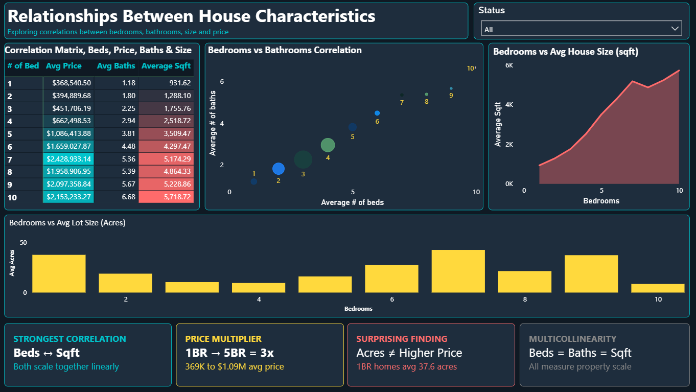
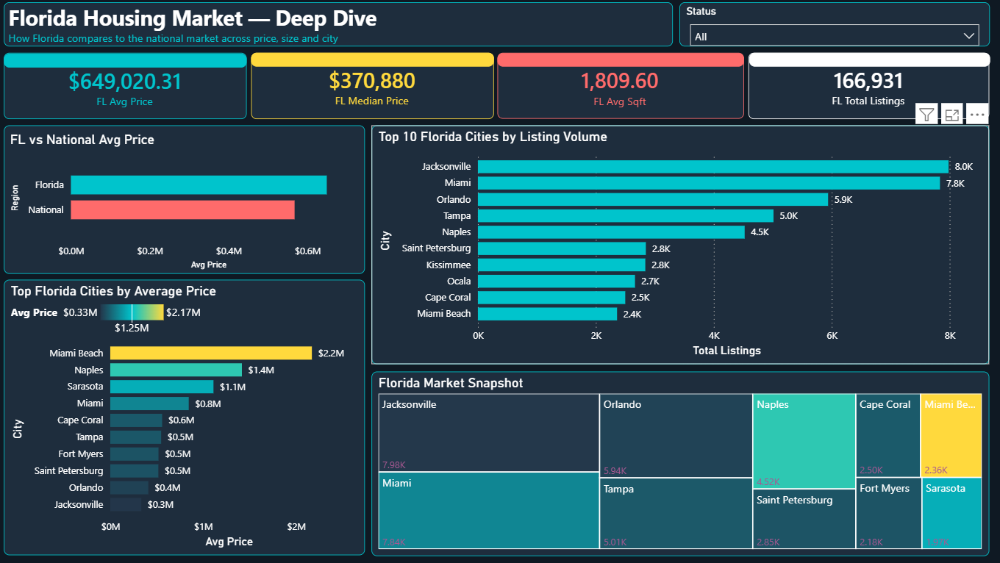
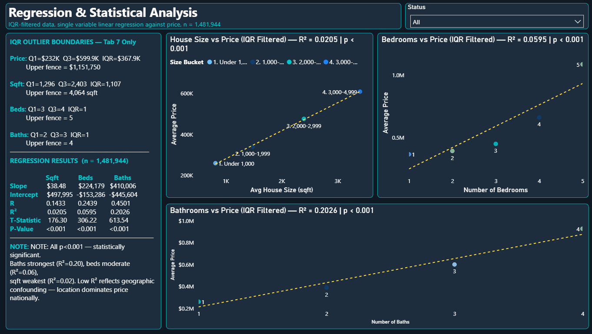
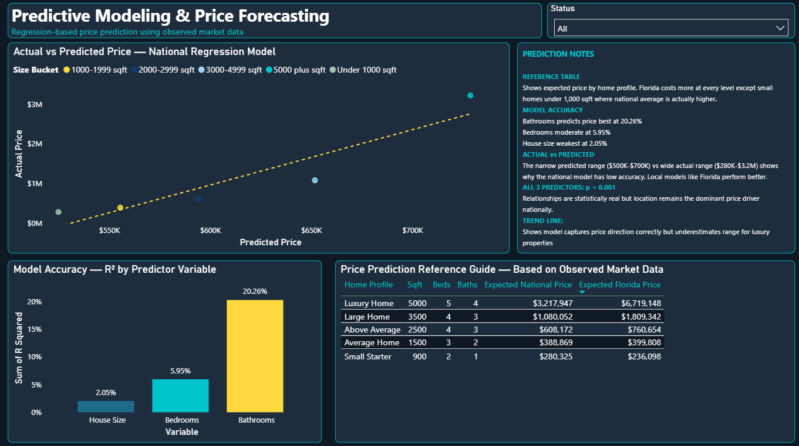
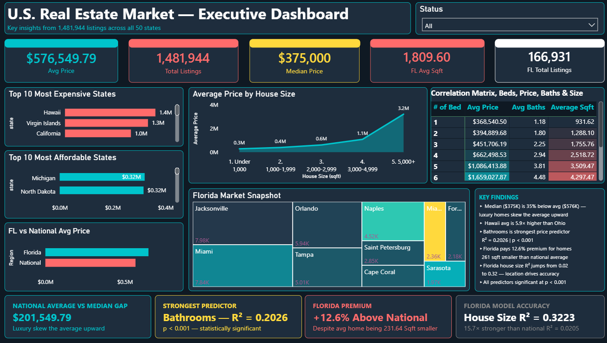

# 🏠 U.S. Real Estate Market Analysis

Comprehensive analysis of **2,226,382 U.S. real estate listings** from Realtor.com conducted as a BIS 470 capstone project at Southern Connecticut State University.

**Tools:** SQL Server Management Studio 20 · Microsoft Power BI Desktop · T-SQL

---

## 📊 Overview

| Item | Detail |
|---|---|
| Raw Records | 2,226,382 |
| Clean Records | 1,481,944 |
| Records Removed | 744,438 (33.4%) |
| States Covered | 50 + DC, Puerto Rico, Virgin Islands |
| National Median Price | $375,000 |
| National Average Price | $576,549 |

---

## 🔑 Key Findings

| Finding | Detail |
|---|---|
| National median price | $375,000 — $201K below mean, confirming right skew |
| Largest geographic spread | Hawaii ($1.41M) vs Ohio ($240K) — a 5.9× gap |
| Strongest single predictor | Bathrooms (R² = 0.20, p < 0.001) |
| Geographic confounding proved | House size R² jumps 15.7× from 0.02 nationally → 0.32 in Florida |
| Florida premium | 12.6% above national average despite 11.4% smaller homes |

---

## 📁 Project Structure

```
├── sql/
│   ├── 01_create_database.sql        # Database and raw table setup
│   ├── 02_bulk_insert.sql            # CSV loading via BULK INSERT
│   ├── 03_cleaning_audit.sql         # Data quality audit
│   ├── 04_create_clean_table.sql     # Filtering, deduplication, type casting
│   ├── 05_statistical_profile.sql    # Descriptive stats, percentiles, IQR
│   ├── 06_analysis_queries.sql       # Q2a–Q2e analysis questions
│   └── 07_regression.sql             # Linear regression — national + Florida
├── dashboard/
│   └── Real_Estate_Capstone.pbix     # Power BI report (8 tabs)
├── docs/
│   ├── Report.md                     # Full written report
│   └── BIS470_Capstone_Report.docx   # Word version
├── assets/                           # Dashboard screenshots
└── data/
    └── README.md                     # Dataset source and download link
```

---

## 📈 Power BI Dashboard

8-tab interactive report with a dark navy theme.

### Tab 1 — Overview


### Tab 2 — Price by Location


### Tab 3 — Price Drivers


### Tab 4 — Correlations


### Tab 5 — Florida Deep Dive


### Tab 6 — Regression Analysis


### Tab 7 — Predictive Modeling


### Tab 8 — Executive Summary


---

## 🔢 Regression Results

All three predictors statistically significant at p < 0.001 across 1,481,944 records.

| Predictor | Slope | R² | T-Statistic |
|---|---|---|---|
| House Size | $38.48/sqft | 0.0205 | 176.30 |
| Bedrooms | $224,179/bed | 0.0595 | 306.22 |
| Bathrooms | $410,006/bath | 0.2026 | 613.54 |

Florida regression (same model, Florida records only):

| Predictor | Slope | R² | Improvement vs National |
|---|---|---|---|
| House Size | $751.62/sqft | 0.3223 | 15.7× stronger |
| Bedrooms | $366,631/bed | 0.0842 | 1.4× stronger |
| Bathrooms | $702,730/bath | 0.2973 | 1.5× stronger |

---

## 🗄️ Dataset

**Source:** [USA Real Estate Dataset — Kaggle](https://www.kaggle.com/datasets/ahmedshahriarsakib/usa-real-estate-dataset)

The CSV (~170MB) is not included due to size. Download from Kaggle and place at `C:\SQLData\Dataset\realtor-data.csv`.

---

## ▶️ How to Reproduce

1. Install SQL Server Express and SQL Server Management Studio
2. Download `realtor-data.csv` from Kaggle
3. Place CSV at `C:\SQLData\Dataset\realtor-data.csv`
4. Run SQL scripts in order (`01` → `07`)
5. Open `Real_Estate_Capstone.pbix` in Power BI Desktop and connect to your SQL Server instance

---

## 👤 Author

**Noah Lopez** — Southern Connecticut State University, BIS 470 (Spring 2026)

📄 [Read the Full Report →](docs/Report.md)
